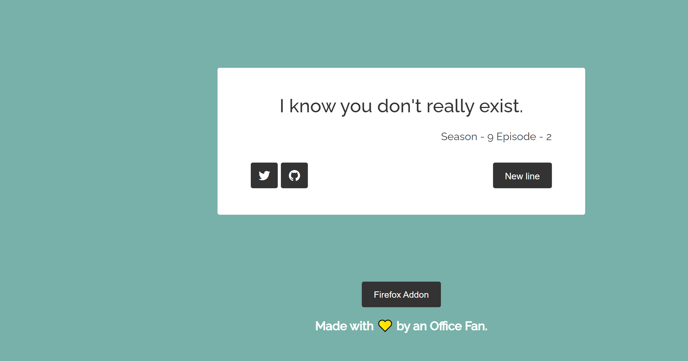

# Readme for Web App

Created with `create-react-app`

Dataset - [The office dialogue kaggle dataset](https://www.kaggle.com/nasirkhalid24/the-office-us-complete-dialoguetranscript "The office kaggle dataset")

Git branch `main`

Extension Link - [FireFox Extension](https://addons.mozilla.org/en-US/firefox/addon/creeds-thoughts/)

Webapp Link - [Random Creed Lines](https://random-creed-lines.netlify.app/)

1. Works similar to a random quote generator, but rather than a quote it displays random dialogue from Creed Bratton from The Office
2. Works as a webapp and browser extension
3. User can tweet the quote directly to twitter.

